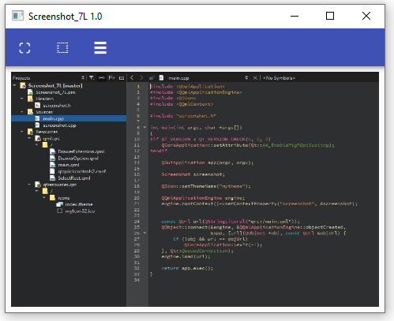
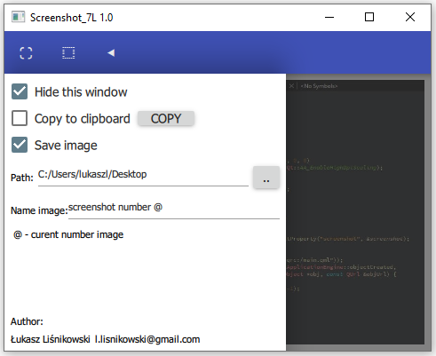

# Screenshot
This is application to do screenshot. It helps cut fixed screen fragment and automatically saved to a location of your choice.

## Table of Contents
* [Technologies Used](#technologies-used)
* [Setup](#setup)
* [Usage](#usage)
* [Project Status](#project-status)
* [Acknowledgements](#acknowledgements)

## Technologies Used
- Qt Creator 5.12
- C++
- Qml

## Setup
To start the application you need to have installed a Qt Creator and open a file **"Screenshot_7L.pro"**, 
When a **Configure Project** windows opened, you have to choose kits and click on **Configure Project**, 
Then just click **Run**.

## Usage
At the top of the app is toolbar with three buttons:,
- First button takes a screenshot,
- Second button allows you to set screen fragment. After setting the area, you have to click ESC.
- Third button gives access to settings. 

## Project Status
Project is: no longer being worked on.

## Acknowledgements
This project was based on [this tutorial](https://doc.qt.io/qt-5/qtwidgets-desktop-screenshot-example.html).

